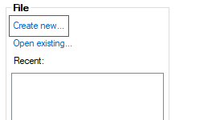
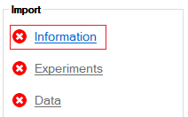
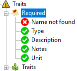
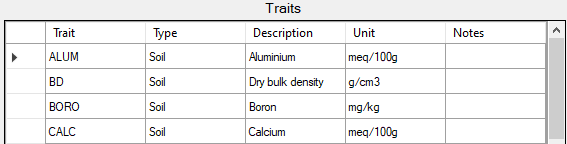
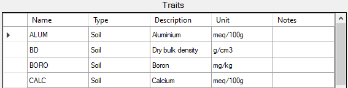
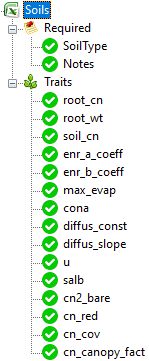
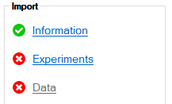

# REMS 2020
## About:
REMS 2020 is a management tool for use with experimental data in agricultural science, developed by [QAAFI](https://qaafi.uq.edu.au/). 

It is designed to be used alongside [APSIM](https://www.apsim.info/), and currently supports up to release 2021.06.22 of APSIM Next Generation. Later versions may still be compatible, but functionality is not guaranteed.

## How to use:
### ___Excel Templates___
Presently, REMS supports the import of data through Microsoft Excel templates. There are three template types, information, experiments and data.

Information contains data that is not experiment specific, such as weather station information, crop species and fertilizer types.

Experiments contains metadata about a set of experiments, such as the location they were run, the researchers involved and details about the distinct trials that were performed. An Experiment file requires an Information file to be imported first.

Data is contains the results of a set of experiments in the form of explicit measurements taken from the field. A Data file requires an Experiments file describing the experiments that sourced the data to be imported first.

### ___Importing Templates___
1. Create a new file to store the data.

2. Click the link to select an Information template to import

3. A page displaying the contents of the file will appear. Warning symbols will show if additional action is required before importing.

4. Ensure all the spreadsheet contains all the required columns

 

changes to

 

5. Additional columns will be imported as traits

6. When all the data is valid, click the button to begin the import

7. After the Information is imported, repeat the process for Experiments, then Data

REMS 2020 stores the imported data in the .db format. The data in these files can be viewed through 3rd party software such as [SQLite browser](https://sqlitebrowser.org/). It is recommended to only use such applications for verifying the contents of the file - any changes to the data should be made by editing and re-importing the excel templates.

### ___Experiment Details___
REMS 2020 provides tools to easily verify the sensibility of data before creating simulations. After importing experimental data, a detailer will become available to quickly visualise the contents.

The imported experiments appear on the left, with options to look at crop and soil data, as well as any operations such as fertilization and irrigation that took place over the course of the experiment.

Each experiment has its own list of trait data, where one or more traits can be selected to display on the chart.